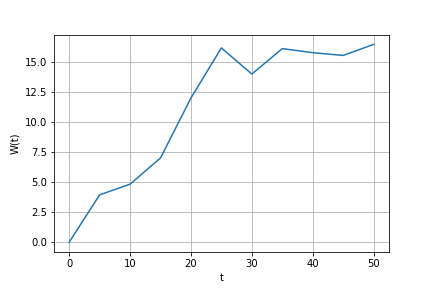
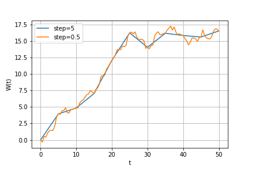
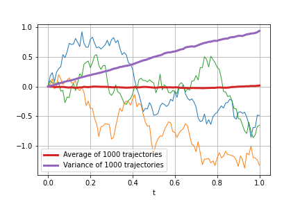
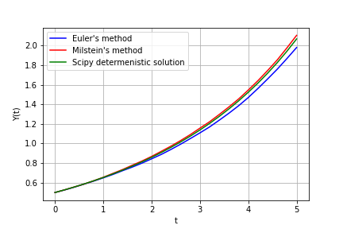

# Numerical Monte-Carlo solution to the system of stochastic differential equations of population dynamics

## Goals and objectives
The final aim of this project was to apply It̂o's stochastic differential equations (SDEs) approach to the field of population dynamics and to compare a stochastic population dynamics model with a deterministic one. In order to use this approach, several tasks should be covered:
1. Stochastic process modelling
2. It̂o's stochastic integral modelling and approximate calculation of its expectations
3. Obtaining numerical solutions to stochastic differential equation (SDE) using Monte-Carlo simulation

## Methods
### It̂o's lemma
Let F be a function F(t, X(t)) and X be a stochastic process such that

<a href="https://www.codecogs.com/eqnedit.php?latex=dX&space;=&space;\mu&space;dt&space;&plus;&space;\sigma&space;dW" target="_blank"></a>

then (assuming the necessary assumptions) function F satisfies the following SDE:

<a href="https://www.codecogs.com/eqnedit.php?latex=dF&space;=&space;(\frac{\partial&space;F}{\partial&space;t}&space;&plus;&space;\mu&space;\frac{\partial&space;F}{\partial&space;x}&space;&plus;&space;\frac{1}{2}\sigma^2&space;\frac{\partial^2&space;F}{\partial&space;x^2})dt&space;&plus;&space;\sigma&space;\frac{\partial&space;F}{\partial&space;x}&space;dW" target="_blank"></a>

It̂o's lemma allows us to find closed-form solution to some SDEs and exactly calculate some stochastic integrals.

### Monte-Carlo simulation 
Monte-Carlo simulation is a computational algorithm that relies on random sampling to obtain numerical result. Pseude-random numbers obtained from Numpy generator were used to simulate randomness

## System requirements
Most of the project (except population dynamics modelling) was implemented in Python using laptop with the following resources:
Intel(R) Core(TM) i5-8300H CPU @ 2.30Ghz, 8GB RAM, Windows 10

Python and libraries:
- Python 3.8.5, 
- Numpy 1.19.1
- Scipy 1.5.0
- Matplotlib 3.3.1
- Seaborn 0.11.0

Population dynamics modelling was implemented in Google colab (with free access). Language and libraries versions are the following:
- Python 3.6.9
- Numpy 1.19.4
- Scipy 1.4.1
- Matplotlib 3.2.2
- Seaborn 0.11.0
- Numba 0.48.0

## Results and examples
There's a small library for stochastic modelling and calculus: StoCalc.py. It is built atop of Scipy and Numpy and provides functions for modelling stochastic processes and integrals, calculation of stochastic integral expectations, and solving SDEs. 
#### 1. Weiner process
Obtain one Weiner process sample path on interval \[0, 50\] with step = 5:
```python
import matplotlib.pyplot as plt
import numpy as np
from StoCalc import weiner_process

np.random.seed(0)

time1, proc1 = weiner_process(t0=0, T=T, m=1, N=11)
plt.plot(time1, proc1)
```


Add more points to this trajectory (so that step would be 0.5):
```python
from StoCalc import brownian_bridge

new_points = np.arange(0, T, 0.5)
time2, proc2 = brownian_bridge(np.array([time1, proc1[0]]), new_points)

plt.plot(time1, proc1[0], label='step=5')
plt.plot(time2, proc2, label='step=0.5')
```

#### 2. It̂o's stochastic integrals
Consider the following It̂o's integral:

<a href="https://www.codecogs.com/eqnedit.php?latex=I(f)&space;=&space;\int_0^1f(t,&space;W(t))dW(t)&space;=&space;\int_0^1t&space;\cdot&space;e^{W(t)}dW(t)" target="_blank"></a>

Calculate first 3 moments, i.e. E(I(f)), E(I²(f)), E(I³(f)), with step=0.01 and different sample size:
```python
from StoCalc import ito_int_expect
np.random.seed(0)

def f(t, Wt):
    return t * np.exp(Wt)

sample_sizes = (10, 100, 10000)
ks = (1, 2, 3)  # moment orders
for size in sample_sizes:
    tmp = [size]
    for k in ks:
        tmp.append(ito_int_expect(f, 0, 1, k, m=size))
    print(*tmp, sep='\t')  
# output:
# 10     0.124  1.163  0.106
# 100    0.116  0.729  0.859
# 10000  0.009  1.291  5.864
```
Generate 1000 samples, plot the first 3 of them, average and variance of trajectories:
```python
from StoCalc import ito_int_paths
np.random.seed(0)

time, paths = ito_int_paths(f, 0, 1, step=0.01, m=1000)

for p in paths[:3]:
    plt.plot(time, p, linewidth=1)
plt.plot(time, paths.mean(axis=0), linewidth=3, label='Average of 1000 trajectories')
plt.plot(time, paths.var(ddof=1, axis=0), linewidth=3, label='Variance of 1000 trajectories')  
```

#### 3. Stochastic differential equations
Consider the following SDE:

<a href="https://www.codecogs.com/eqnedit.php?latex=\begin{cases}&space;dY(t)&space;=&space;f\cdot&space;dt&space;&plus;&space;g\cdot&space;dW(t)=\left(&space;\frac{1}{4}&space;Y(t)&space;&plus;&space;\frac{1}{32}Y^2(t)&space;\right)dt&space;&plus;&space;\frac{1}{4}Y(t)dW(t),\&space;\\&space;Y(0)&space;=\frac{1}{2}&space;\end{cases}" target="_blank"></a>

Obtain 1000 solutions using Euler's and Milstein's method and compare average of 1000 solutions for both methods with Scipy-provided solver for a corresponing determenistic ODE:
```python
from StoCalc import sde
np.random.seed(0)

def dyE(y, dt, dW):
    f = 1/4 * y + 1/32 * y**2
    g = 1/4 * y
    return (f, g) 

def dyM(y, dt, dW):
    f = 1/4 * y + 1/32 * y**2
    g = 1/4 * y
    dgdy = 1/4   # need to provide additional derivative for Milstein's method
    return f, g, dgdy

y0 = 1/2
step = 1/5  # step size is large to see the difference between methods
t = (0, 5)

time, pathsE = sde(dyE, y0, t, step, method='euler')  # Euler's method
time, pathsM = sde(dyM, y0, t, step, method='milstein')  # Milstein's method

# determenistic equation
from scipy.integrate import odeint

def det_dydt(y, t):
    return 1/4 * y + 1/32 * y**2

sol = odeint(det_dydt, y0, time)

plt.plot(time, pathsE.mean(axis=0), color='blue', label="Euler's method")
plt.plot(time, pathsM.mean(axis=0), color='red', label="Milstein's method")
plt.plot(time, sol, color='green', label='Scipy determenistic solution')
```
See [examples](Examples.ipynb) for more.

## References 

1. Allen, Edward. (2007). Modeling with Itô Stochastic Differential Equations. 22. 10.1007/978-1-4020-5953-7. 
2. Choongbum Lee, Peter Kempthorne, Vasily Strela, Jake Xia. 18.S096 Topics in Mathematics with Applications in Finance. Fall 2013. Massachusetts Institute of Technology: MIT OpenCourseWare, https://ocw.mit.edu/. License: Creative Commons BY-NC-SA.
